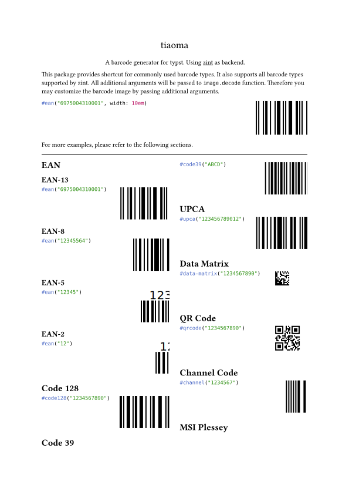
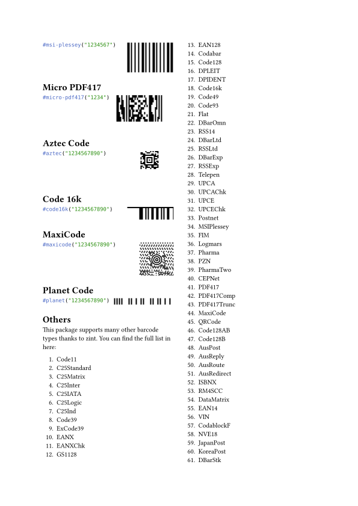
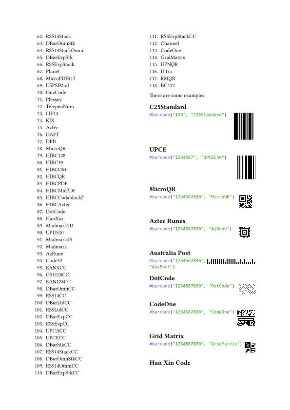
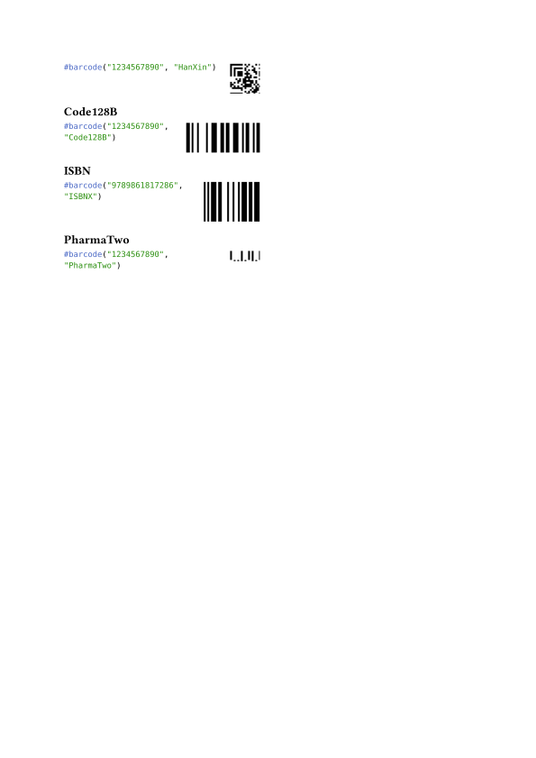

# zint-wasi

This is a Zint binding for WASI.

- `zint-wasm-sys` is a low-level binding to the Zint library.
- `zint-wasm-rs` is a high-level binding to the Zint library.
- `zint-typst-plugin` is a typst package for the Zint library.

This package only uses the Zint library but not any of its frontends. So it is MIT licensed.

Checkout examples and `typst-package/manual.typ` for more information.

